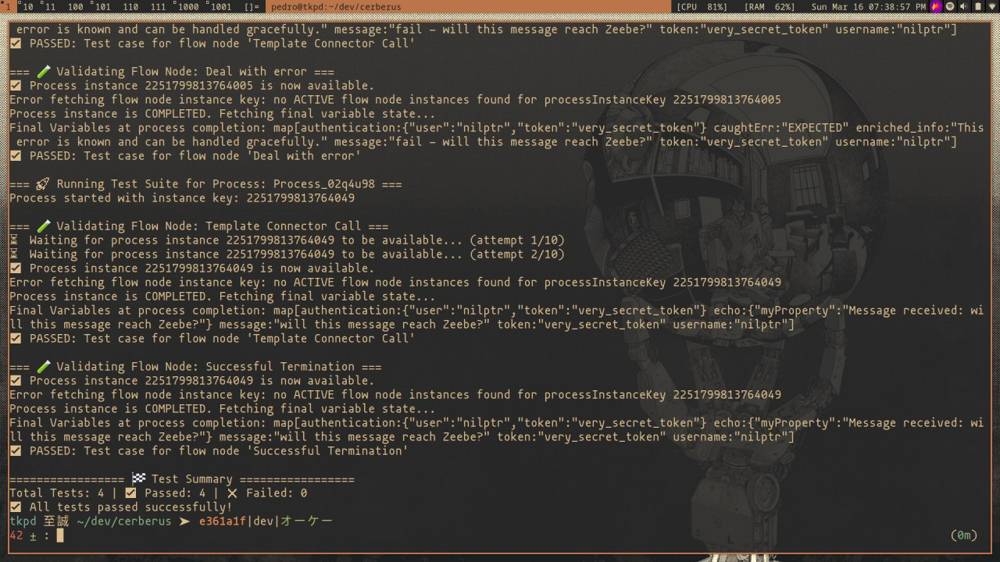

## Testing Ports:

### Zeebe:

- gRPC and related API on port 26500
- Health check on port 9600
- (Additional HTTP interface on 8088)

### Operate:

- Main interface on port 8081

### Tasklist:

- Accessible on port 8082

### Connectors:

- Accessible on port 8085

### Optimize:

- Accessible on port 8083 (internally runs on 8090)

### Identity:

- Accessible on port 8084

### Keycloak:

- Accessible on port 18080

## Credentials

### Operate: 

- username: demo

- password: demo

### Keycloak

- username: admin

- password: admin

## Audiences

### Zeebe:

- zeebe-api

### Operate:

- operate-api

### Optimize:

- optimize-api

### Tasklist:

- tasklist-api

These values are then used by Identity to validate tokens and are embedded in the `JWT’s` aud claim.

## Template Directory on Linux

`/opt/camunda-modeler/resources/element-templates`

